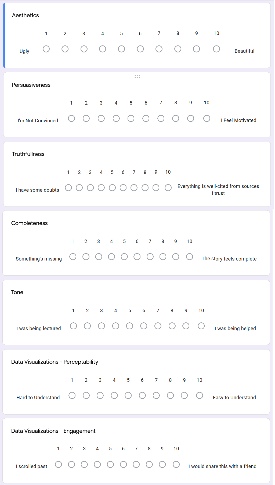

# Part II: Building the Story
## Introduction
In this section, I worked to build upon the outline of <a href = "https://adorseyt.github.io/Dorsey-Tyler-Portfolio/FinalProject.html"> Part I: Project Wireframe</a> to create a cohesive story. We were given the option to create a storyboard or work within the final deliverable to create a draft. I opted to work directly on the draft... and may have gotten carried away. What resulted is a first attempt at the presentation - including finalized visualizations, text, and other aesthetic elements. While this may have front-loaded the work towards the final product, it may have reduced the flexibility and openness to feedback, which will be discussed in the user research study. 

## Draft Product
What was created is available here: <a href="https://preview.shorthand.com/mTLdFk9VoVRnOH1p">"The Planet Needs You... To Take Pictures of Bugs"</a>.

## User Research

### User Research Protocol

#### Focusing the Audience
When seeking to define my core audience, I focused on prior knowledge, agency, and want. I'm reaching out to readers who are already well-informed about the evidence behind Anthropogenic climate change and feel strongly about the future of the planet. They may have a background or interest in biology, ecology, conservation, and environmental protection. They fall into two major personas, abstracted here:

<i><b>Clint:</b> Boomer. Participated in the environmental movements of the 1960-70's. Enjoys hiking and bird-watching. Studied biology at the university level. Feels angry about the lack of apparent awareness among his friends.

<b>Claire:</b> Millennial. Very in-tune with news related to climate change and caters their social media content towards this subject. Enjoys rock climbing and reading. Studied business at the university level, but listens to podcasts surrounding ecology and environmentalism. Feels overwhelmed about the scope of the problem, but feels a sense of comradery with their peers.
</i>

It should be noted that neither group has explicit interest or prior knowledge in insects specifically. Both Clint and Claire tend to focus on the big picture of envrionmentalism and conservation, and may find insects creepy or insignificant. 

In terms of agency, I'm focusing on readers who are willing to make personal behavioral changes to their lifestyle, but often feel powerless when solutions are out of their hands. They may contact their representatives and try to restrict purchases from companies that don't align with their ethics, but otherwise feel that many big actors - governments, companies, and populations as a whole - are at a scope that causes them to shut down.

Both Clint and Claire want to feel like their contributions matter. They want to be informed about the reality of the crisis, but don't want a lecture without a solution. They want to feel like they are part of a greater movement, that their small actions combine with others to make actual progress. 

#### Audience Selection
I was able to get 4 test audience members to provide feedback from the draft - two that more closely align with the "Clint" persona, and two for "Claire". Both groups have gender diversity. All respondents come from my personal social circle - they are family members and long-term friends - mainly because they had the most availabity to be flexible for interview times and motivated to work on short notice.

### Research Methodology
In order to collect robust and untampered results, I conducted both a survey and interviews with each feedback member. 

The survey was presented as a link, with scale questions respondants could complete as they looked through the presentation. I did this because each of the interviewers have a personal relationship with me as an author; they know I'm passionate about this subject, and have heard about my progress as I built out the draft. For this reason, I feel it's difficult to them to provide critical feedback without wanting to be encouraging. Having at least a portion of the response not be said directly to my face might encourage more candor.

In addition, I drafted guided interview questions that built upon their scores and facilitated more detailed feedback. The following sections will outline the questions posed and the responses.

#### Survey Format
Below is a copy of the questions posed in the survey that was sent alongside the presentation draft:

#### Interview Format
I conducted interviews the same day the respondent completed the survey. Below is a copy of the interview script:

1. Thank you for your feedback and agreeing to talk more. Understanding that your identity will not be revealed in any publication. Feedback will be aggregated where possible, though individual quotes may be taken. Any identifying information will be removed. Do you have any questions?

2. Now I'm going to ask for some general feelings: Were there parts that surprised you?

3. Were there any parts that were unclear or confusing?

4. Could you walk me through some of the thoughts going through your head as you read through?

5. What would you like to see changed in the final version of this presentation?

6. What would you NOT like to see changed?

7. Let's walk through the survey; are there any points you'd like to provide additional information?

8. Thank you so much for your participation and feedback. Both the final version of the presentation and the findings of the user research will be shared with you. Do you have any questions?

### Results
Below I've outlined the mean responses to each survey question, alongside any comments given about the survey during the interview:

### Were there any parts that surprised you?
One discussed the fact that insects to entomologists ratio is so high, one remarked on the proportion of insects to animal species. One noted "Honestly, all of it, since it's pretty much entirely new information to me. I would say the most surprising things I learned were the cost of insect loss and also just how many insects there are in relation to other animals." The final answered "No, I've been saying similar things for a while. I was happy to hear that different parts connected with different people, but am noting that none of them mentioned the call to action. I'm wondering if there's something missing there?

#### Were there any parts that were unclear or confu?
Three of my respondents gave simple "No", one said "Nope, everything was pretty clear to me."

### 

#### Aesthetics - 9.5
Many of the respondents replied that the presentation was "beautiful", with one noting that "It looks like those magazine articles the New York Times does". One responded that "The green is serene and perfect for the topic". In regards to the photos, one noted "The images are great! They didn't distract me from the presentation and they're very pretty, high quality images that are really cool to look at when I do notice them."

#### Persuasiveness - 9.25
The comments provided in this section mainly focused on the persuasiveness of the gravity of insect biodiversity loss: "40 years without bugs is scary close". As to the call to action, one respondent noted "I already have iNaturalist!", one said she felt it was an easy behavioral change though she wasn't as convinced it was enough to stop the crisis, and one said "If we're being honest, it's winter right now so by the time this is useful I'll probably have forgotten". Respondents gravitated to the economic toll, and felt it should be at the forefront. They wanted to know about other effects insect loss would have.

#### Truthfullness 9.25
Truthfullness got high scores in the survey, but some clear issues were identified in the interview. One respondent said she was expecting a bibliography at the end, especially since so few links were provided for further reading. Another noted that the presentation is misleading - we do know about the causes to insect loss, it's on IUCN's page for the species that have been assessed. I pointed out that while IUCN and Sanchez-Bayo hint at potential causes, there are published arguements that make a pretty solid case that nothing is conclusive. That report is currently not cited anywhere in the presentation. The same was said about effects - that while we know that insects are keys to food chains, the loss of other animals has not yet been tied to loss of insects in non-preliminary studies. Once I explained the N in the insectivore study provided, he was convinced. However, it's obvious that there is more work to be done here; facts need to have linked citations, and the inconclusive nature of stated facts needs to be overt.

#### Completeness 8.75
The scores here were the least clustered, with 3 10's and a 5. The respondents who gave the 10's had few notes; they felt the presentation told a whole story. The respondent with a 5 used this as the area to provide feedback about the causes/effects that are described above.

#### Tone 5.5
Here respondents all fell in the middle between "I was being lectured" and "I was being helped". In the interviews, a few respondents pointed out that this is an informative piece about an important issue, so a "low" score here doesn't necessarily mean that changes are required. I did note them picking up on specific language though - such as the repetition of "paints a grim picture". One respondent did not like the assumption that "tigers are more alluring and pandas are more endearing" - noting that they personally like all animals. Another noted that "it's a hard balance - you need people to care, but you don't want people <i>who do care</i> to feel like failures. There's a lot of information about climate change and most of it's bad. It's like, we're trying out best to be informed, you know?". Overall, they attributed this more to the topic than the tone, but I believe some language changes can put less onus on the reader and create a more collaborative atmosphere.

#### Data Visualizations - Perceptability 10
The overwhelming response was that the data was presented in interesting and easy-to-understand ways, and fit in well with the surrounding text. One note was to darken the colors of the 23,000 in the entomologist visualization. Not from the interviews, but I received some peer feedback that this presentation is well-made for big screens, but not phones. 

#### Data Visualizations - Engagement 8.5
There were few notes on this section... which I might attribute a bit to question fatigue. Overall, they felt the message titles made it easy to share some of the visualizations outside of the presentation, but didn't know when they'd actually want to. One said "The presentation overall is very shareable".

